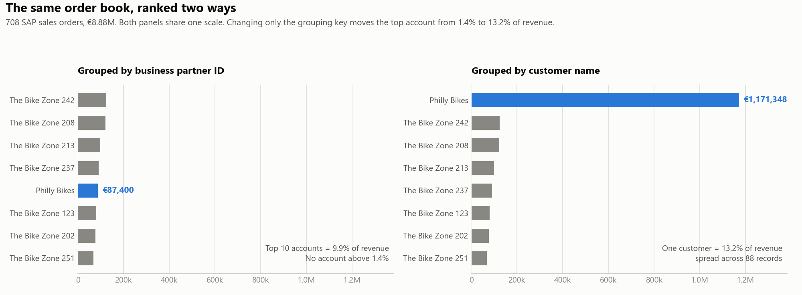

# Order-to-Cash Analytics — 708 SAP Sales Orders

Analysis of a sales-order extract pulled from SAP S/4HANA 2022 (Fiori, Global
Bike training client) during graduate coursework in enterprise systems.

**→ [Read the findings](findings.md)**

## The short version

The order book contains 708 orders worth €8.88M. Three things came out of it:

1. **Customer concentration is reported wrong.** Grouped by business partner ID,
   no customer exceeds 1.4% of revenue. Grouped by customer name, "Philly Bikes"
   turns out to span **88 separate business partner records** worth **13.2% of
   revenue**. Same data, opposite conclusions, depending on one field choice.


2. **€1.1M (12.4%) of the book is unfulfilled**, and stalled orders run 29% smaller
   than completed ones.
3. **Seven orders have a requested delivery date before their order date**, four
   of which were marked Completed — enough to invalidate any on-time-delivery
   metric built on this table.

## Why this dataset

Global Bike is SAP's teaching client, shared across a whole course, so some
patterns here are artefacts of that rather than commercial signals. The findings
document says explicitly which are which. I kept them in because separating a
real signal from a system artefact is the actual skill — and because using
synthetic SAP data means this analysis can be published without touching
anything confidential.

## Repository layout

```
data/sales_orders.csv        cleaned extract, 708 rows
charts/                      generated figures (committed)
scripts/prepare_data.py      raw .xlsx -> analysis-ready CSV
scripts/run_analysis.py      loads SQLite, executes every query in sql/
scripts/make_charts.py       regenerates charts/ from the same CSV
sql/01_order_status_profile.sql        order book by fulfilment status
sql/02_requested_lead_time.sql         lead-time distribution
sql/03_revenue_concentration.sql       top accounts, running total (window fn)
sql/04_order_value_clustering.sql      repeated exact order values
sql/05_data_quality_checks.sql         six validation checks
sql/06_duplicate_customer_masters.sql  the duplicate-master finding
findings.md                  the write-up
```

## Data preparation

The raw Fiori export needed three fixes before it would support any analysis —
all of them typical of SAPUI5 spreadsheet downloads:

| Problem | Fix |
|---|---|
| Dates exported as Excel serials (`46139`) | Converted to ISO dates against the 1899-12-30 epoch |
| Sold-to party packs name + ID in one string: `The Bike Zone 771 (1004142)` | Split into `customer_name` and `business_partner_id` — this is what made finding 1 visible |
| Net value stored as text | Cast to float |

A derived `requested_lead_days` column was added at this stage.

## Running it

The cleaned extract is committed, so this runs immediately after cloning:

```bash
python scripts/run_analysis.py
```

Standard library only — no dependencies. SQLite is loaded in memory and nothing
is written to disk.

`scripts/prepare_data.py` is included to document the extraction and cleaning
logic, but the raw SAP export it consumes is not redistributed in this
repository. To re-run that stage against your own Fiori export:

```bash
python scripts/prepare_data.py "your-export.xlsx" data/sales_orders.csv
```

## Tools

SQL (CTEs, window functions, `ROW_NUMBER`, running totals), Python, SQLite, SAP
S/4HANA Fiori.
