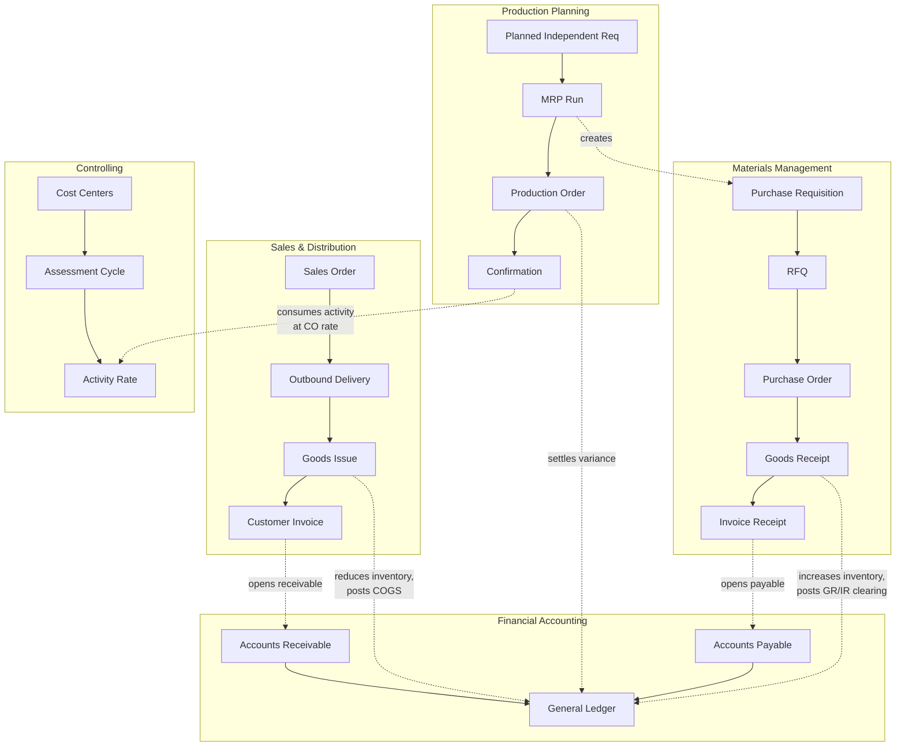
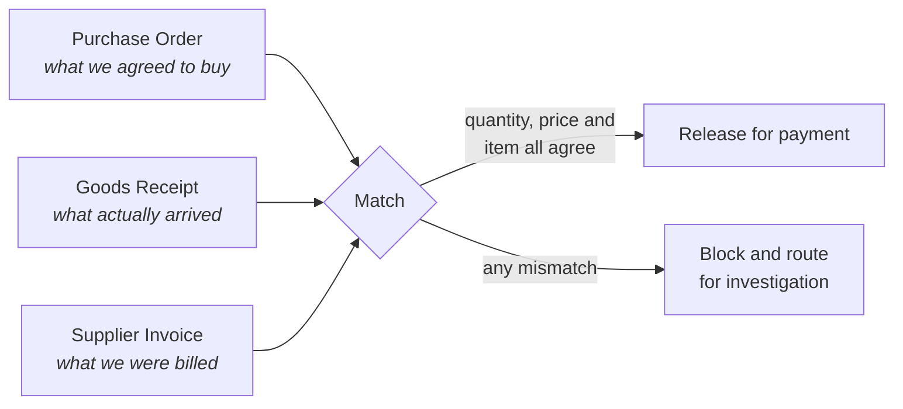

# SAP S/4HANA Process Documentation

Process maps for five enterprise cycles I executed end to end in SAP S/4HANA
2022 (Fiori 3.0) against a single shared dataset, so the document flows below
connect to each other rather than standing alone.

These are written from my own execution notes. They contain no material from the
SAP UCC curriculum, and the document numbers referenced are ones my own
transactions generated.

| Cycle | Module | Documented in |
|---|---|---|
| Order-to-Cash | SD | [order-to-cash.md](order-to-cash.md) |
| Procure-to-Pay | MM | [procure-to-pay.md](procure-to-pay.md) |
| Plan-to-Produce | PP | [plan-to-produce.md](plan-to-produce.md) |
| Record-to-Report | FI / CO | [record-to-report.md](record-to-report.md) |
| Project accounting | PS | [project-accounting.md](project-accounting.md) |

---

## Why the integration is the interesting part

Any one of these cycles can be learned from a diagram. What you cannot get from
a diagram is what happens at the seams — where a document in one module silently
creates an obligation in another, and where that goes wrong.

Three seams that only become visible once you have run both sides:

**MRP is where planning becomes a purchasing obligation.** Running MRP against a
planned independent requirement generated purchase requisitions automatically.
Nobody in purchasing decided to buy anything — a forecast did. If the forecast is
wrong, the error is already a commitment by the time a human sees it.

**Goods receipt posts to the general ledger before any invoice exists.** The GR/IR
clearing account holds the difference between what was received and what was
billed. It is the single most common source of period-end reconciliation work in
an SAP shop, and it exists purely because the physical and financial events are
decoupled.

**Controlling rates are set before the costs they allocate are known.** In the
cost-centre cycle I planned activity output, ran an assessment to push service
costs onto operating centres, and let the system calculate an activity rate —
€45/hour for assembly, €50/hour for maintenance. Production then consumed
activity at that planned rate. The gap between planned and actual surfaces later
as a settlement variance, which is why manufacturing variance analysis is a
controlling problem and not a shop-floor problem.

---

## Three-way matching

The control that connects MM and FI, and the one most likely to come up in
interview:

The system compares all three before releasing payment. If the invoice bills for
more than was received, or at a price the PO did not authorise, payment blocks
automatically. This is why ERP procurement is a fraud control and not just a
convenience — it removes the discretion that manual AP processing depends on.

---

## Master data is the failure mode

Every cycle above runs on master data created before any transaction: business
partners, material masters, G/L accounts, cost centres, activity types, routings,
bills of material.

That is the theory. The practical version is finding 1 in
[the order-to-cash analysis](../01-order-to-cash-analytics/findings.md) —
one customer spread across 88 business partner records, which broke customer
concentration reporting badly enough to invert the conclusion. The transactional
processes all worked perfectly. The reporting on top of them was wrong anyway.
