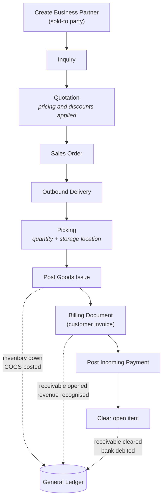

# Order-to-Cash (SD)

The revenue cycle: from a customer asking what something costs, to cash cleared
against the receivable.

## Steps

| # | Step | What it creates | Why it exists |
|---|---|---|---|
| 1 | Create business partner | Customer master record | Nothing can be sold to an entity the system does not know |
| 2 | Inquiry | Non-binding enquiry doc | Captures interest without commitment; makes lost demand visible |
| 3 | Quotation | Binding offer, valid to a date | Where pricing conditions and discounts are applied |
| 4 | Sales order | Commitment to supply | Availability check runs here; the order is now a promise |
| 5 | Outbound delivery | Delivery document | Splits the *promise* from the *shipment* — they can differ |
| 6 | Picking | Confirmed pick quantity + storage location | Ties the delivery to physical stock in a specific place |
| 7 | Post goods issue | Material document | **First financial event** — inventory falls, COGS posts |
| 8 | Billing | Customer invoice | Revenue recognised, receivable opened |
| 9 | Incoming payment | Payment document | Cash in |
| 10 | Clearing | Cleared open item | Receivable closed against the payment |

## The part that is easy to get wrong

**The order is not the revenue event.** Three separate documents each post
something different: goods issue moves inventory and cost, billing recognises
revenue and opens the receivable, payment clears it. A sales order sitting in
the system has produced no financial effect at all.

This is why the status analysis in
[the order-to-cash project](../01-order-to-cash-analytics/findings.md) matters —
€1.1M of orders in Open or In Process status are commitments the business has
made and not yet earned anything from. Reading the order book as revenue would
overstate it by 12.4%.

## Pricing

Pricing is condition-based rather than a single stored number. In the case study
I applied a material-level discount and a net-level discount to the same order
and observed them resolve in sequence against the base price. The order also
exposed an internal price separate from the customer-facing one — the transfer
value used for internal margin measurement, not something the customer ever
sees.

The practical consequence: a question like "what does this product cost?" has no
single answer in an ERP system. It depends on customer, quantity, date, and
which condition types apply. Analysts who assume one price per material get
margin analysis wrong.

## Document flow

Every document keeps a link to its predecessor and successor. Opening the
document flow on a completed order shows the full chain — inquiry through to
cleared payment — with each document's status. This is the audit trail, and it is
also the fastest diagnostic tool available: when a customer asks where their
order is, the flow shows exactly which step it stopped at.
