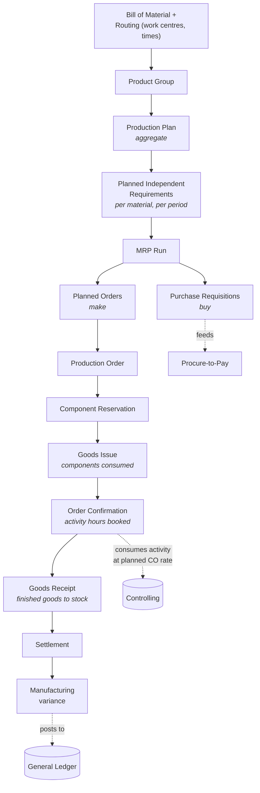

# Plan-to-Produce (PP)

Forecast to finished goods. This is the cycle where planning decisions turn into
purchasing commitments without a human in the loop.

## The chain in words

**Bill of material and routing** define what a product is made of and the
operations needed to make it — which work centres, in what sequence, taking how
long. Together they are the cost model: change a routing time and standard cost
changes.

**Product group and production plan** set volume at an aggregate level, then
disaggregate down to individual materials as **planned independent requirements**
— the demand forecast the whole cycle runs on.

**The MRP run** is the pivot. It reads demand, checks stock and existing
coverage, applies lead times, and produces planned orders for things made
in-house and purchase requisitions for things bought. This is where a forecast
becomes an obligation.

**Production order** converts a planned order into a live shop-floor instruction,
reserving components. **Goods issue** consumes them. **Confirmation** books the
activity hours actually worked. **Goods receipt** puts finished product into
stock. **Settlement** compares what production actually cost against standard and
posts the difference.

## Manufacturing variance

Settlement variance is the difference between actual production cost and the
standard cost of what was produced. It is the number that tells you whether the
cost model still reflects reality.

It has to exist because the two sides are set at different times. Standard cost
comes from the routing and BOM plus a controlling activity rate planned before
the period started. Actual cost comes from components genuinely consumed and
hours genuinely booked. A persistent variance in one direction usually means the
standard is stale, not that the shop floor is failing.

## Lead time is the constraint that bites

The lesson that transferred most directly out of the
[ERPSim simulation](../05-erpsim-simulation/README.md): replenishment took three
or more simulated days to arrive. Running MRP at the moment stock ran low was
already too late — the order would land after the stockout.

The planning parameters are not administrative settings. They determine whether
the plan is executable at all. Any analysis of stockouts that looks only at
demand and ignores lead time will misdiagnose the cause every time.
