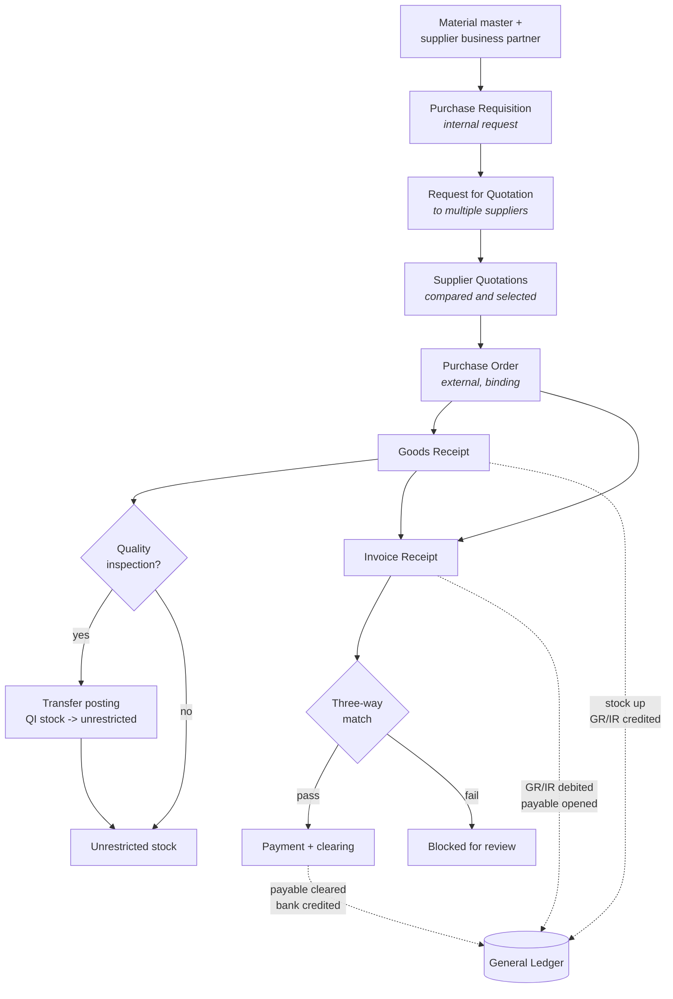

# Procure-to-Pay (MM)

From identifying a need to paying the supplier. This is the cycle I documented
most closely, and the one with the clearest internal controls.

## Requisition vs order — the distinction that matters

| | Purchase requisition | Purchase order |
|---|---|---|
| Direction | Internal | External |
| Binding | No | **Yes, legally** |
| Audience | Approver inside the company | Supplier |
| Created by | Requesting department, or **automatically by MRP** | Procurement |

A requisition is a request. A purchase order is a contract. The approval step
between them is the entire control — once it converts, the company owes money
whether or not anyone still wants the goods.

## Stock is not one number

Goods receipt does not always produce sellable inventory. Received stock can land
in **quality inspection**, where it exists and is owned but cannot be used. A
transfer posting moves it to unrestricted once inspection passes.

This is a routine source of analytical error: "we have 500 units" is meaningless
without knowing which stock type they sit in. Available-to-promise calculations
that ignore stock type will over-promise.

## GR/IR clearing

The account that makes this cycle work, and the one that generates the most
period-end effort.

- **Goods receipt posts first** → inventory increases, GR/IR is credited
- **Invoice receipt posts later** → GR/IR is debited, payable opens

Between those two events, GR/IR holds the value of goods received but not yet
billed. A balance on it at period end means something is out of step — goods
arrived and the invoice never came, or an invoice was posted against a receipt
that never happened. Clearing it is real work in every SAP shop, and it exists
entirely because physical and financial events are deliberately decoupled.

## Three-way matching

Purchase order (what we agreed) + goods receipt (what arrived) + invoice (what we
were billed). All three must agree on quantity, price, and item before payment
releases.

The control value is that it is automatic and non-discretionary. Manual AP
depends on someone choosing to check; three-way matching removes the choice.
Most classic AP fraud — duplicate invoices, invoices for goods never delivered,
inflated quantities — fails at this gate without human involvement.

## Where the data quality risk lives

Everything above assumes supplier data is clean. Unit-of-measure mismatch is the
canonical failure: a supplier sending "cases" where the system expects "units"
produces a PO for the wrong quantity, a goods receipt that appears to under- or
over-deliver, and a three-way match failure that looks like a supplier problem
but is a master-data problem.

The interconnection that makes ERP valuable is the same property that propagates
one bad field across inventory, payables, and financial reporting simultaneously.
