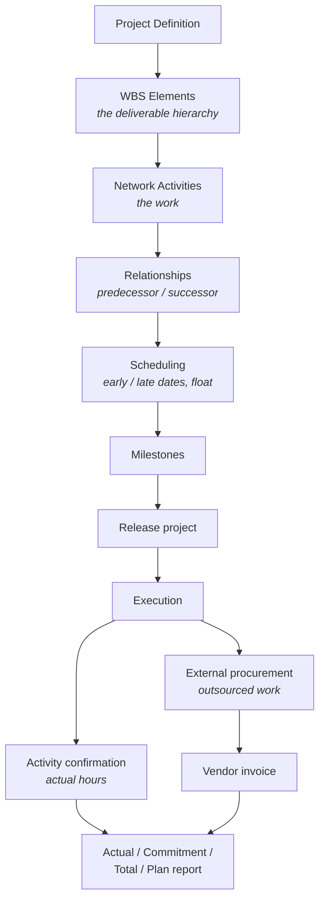

# Project Accounting (PS)

Where a project is a cost object in its own right — budgeted, tracked, and
settled like a mini business unit. The case I ran was a new-product development
project for an ultralight bicycle.

## Structure: two hierarchies, not one

**WBS elements** are the deliverable breakdown — engineering, prototype, testing,
small-series production, release to mass production. They answer *what are we
producing?* and they are what costs roll up to.

**Network activities** are the work packages that consume time and resources.
They answer *what has to be done, in what order?*

They are separate because scope and schedule are separate concerns. An activity
can slip without the deliverable changing; a deliverable can be cut without
rescheduling everything.

## Scheduling

Linking activities with predecessor/successor relationships lets the system
compute earliest and latest start and finish dates, and from those, **float** —
how much an activity can slip before the project end date moves.

In the network I built, activities with zero float sat on the critical path;
others carried five days. That distinction is the whole value of the model: it
tells a project manager which delays matter and which are noise.

## Cost tracking: three numbers, not one

The project cost report separates:

| Column | Meaning |
|---|---|
| **Plan** | What we budgeted |
| **Commitment** | Ordered but not yet received or invoiced |
| **Actual** | Incurred and posted |
| **Total** | Actual + commitment — true exposure |

**Commitment is the column analysts forget.** A purchase order raised against a
project is money the company has committed to spend even though no invoice has
arrived and actuals still look healthy. A project reporting actuals well under
budget can already be overspent once commitments are counted.

In my project, actual costs of €24,700 sat against a plan of €49,433 — apparently
50% under budget. Adding the €5,000 commitment brings true exposure to €29,700.
Still under, but the gap between the two views is exactly where project overruns
hide.

## Internal vs external work

Activities are either internal (consuming labour at a controlling activity rate)
or external (procured through a purchase order, invoiced by a vendor). Both post
to the same project, so the cost report shows a single picture regardless of who
did the work.

Reading the cost element report by activity showed labour concentrated in
engineering work — the carbon frame activity alone carried €12,000 of labour
cost, the largest internal item on the project. That is the kind of answer a
project sponsor asks for and a well-structured WBS gives up immediately.
