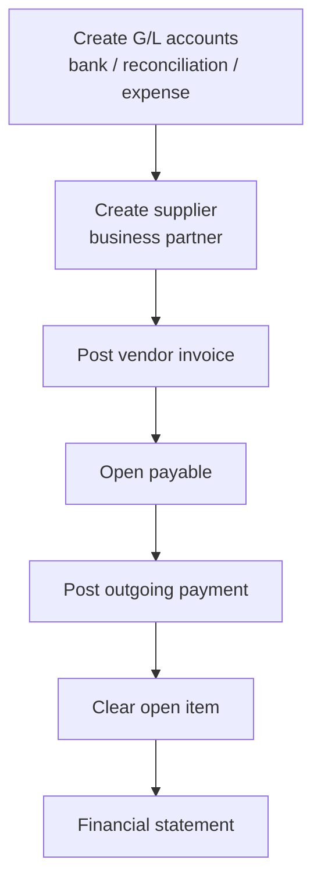
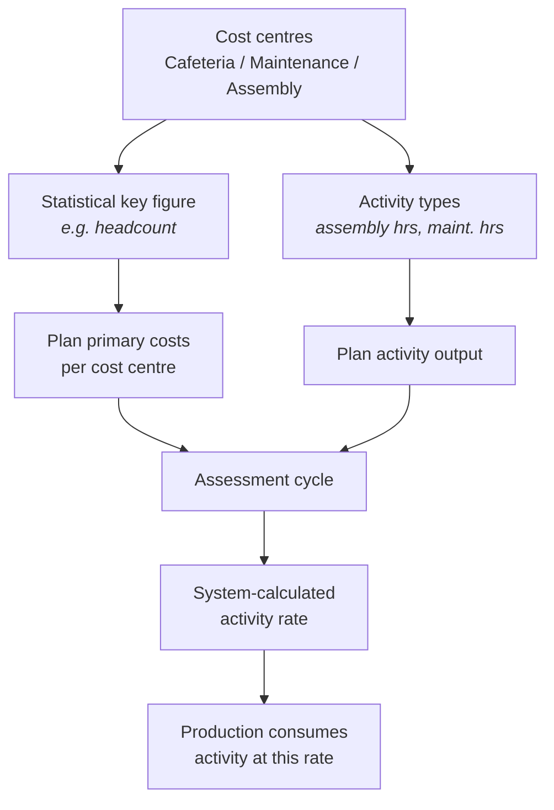

# Record-to-Report (FI / CO)

Two systems that look similar and answer different questions.

- **Financial Accounting (FI)** — external reporting. Statutory, audited, tells
  outsiders what happened to the company as a whole.
- **Controlling (CO)** — internal reporting. Tells managers where money went
  inside the company and what things cost to do.

The same transaction usually posts to both.

## FI: accounts payable cycle

Two structural points worth knowing:

**Reconciliation accounts** connect the sub-ledger to the general ledger. Supplier
balances live in the AP sub-ledger; the reconciliation account carries their
total in the G/L automatically. You never post to it directly — the link is what
guarantees the sub-ledger and G/L can never diverge.

**Clearing is a distinct event from payment.** Posting a payment and clearing the
open item it settles are separate. An unclear item means the system does not know
which invoice a payment settled, so aged-payables reporting stays wrong even
though cash has moved.

## CO: cost centre accounting

The cycle I ran used three cost centres — cafeteria, maintenance, assembly — and
made the logic concrete:

1. Plan what each centre will spend, and how much output the operating centres
   will produce (assembly hours, maintenance hours).
2. The cafeteria is a **service** centre. It produces no billable output, so its
   cost has to land somewhere. An **assessment cycle** distributes it to the
   operating centres, allocated on a **statistical key figure** — headcount.
3. Once service costs have been pushed down, the system divides total planned
   cost by planned output to get an **activity rate**: €45/hour for assembly,
   €50/hour for maintenance.
4. Production then consumes activity at that rate, which is how an overhead like
   subsidised staff catering ends up embedded in the cost of a bicycle.

**Why an analyst should care.** Product cost is not the sum of its parts. It
carries allocated overhead whose size depends on the allocation base someone
chose. Change the statistical key figure from headcount to floor space and every
product cost in the system changes without a single real cost changing. Anyone
comparing product profitability without knowing the allocation basis is
comparing artefacts of a configuration decision.

## The two systems in one sentence

FI says *the company spent €90,000 on catering*. CO says *that €90,000 was
assessed onto the assembly cost centre, and now sits inside the €45/hour rate
that every bike absorbs* — assembly's total planned debit of €270,000 divided by
6,000 planned hours.

Both are true. They answer different questions, and confusing them produces
confident, wrong analysis.
