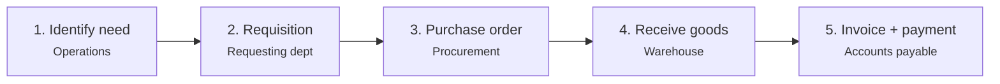

# ERP-Driven Procurement at Scale — Walmart / Oracle ERP Cloud

Research project on how procurement operates inside an ERP system at extreme
scale, delivered as a 10-minute presentation with defended Q&A.

**Companion piece:** [qa-reference.md](qa-reference.md) — the 17 questions I
prepared to defend this analysis, with answers.

---

## Why Walmart

Scale makes the mechanics visible. Walmart runs roughly 10,500 stores across 24
countries with about 100,000 suppliers, on Oracle ERP Cloud alongside JDA for
supply chain. At ~$400B in annual purchasing, every property of ERP procurement —
the benefits and the failure modes — is magnified until it can be observed
rather than assumed.

## The concept

Procurement is the full cycle of acquiring what an organisation needs: need
identification, requisition, purchase order, goods receipt, invoice, payment.

What ERP changes is not any individual step but the connections between them.
Approval workflows fire automatically, inventory updates the moment goods are
received, financial records update without re-entry. The distinction that matters:

> ERP-driven procurement links purchasing directly to inventory management,
> accounts payable, and budgeting in a single system in real time. Manual or
> spreadsheet-based purchasing links them by human effort, which means each link
> is a chance to introduce an error.

## The cycle

One approved purchase order simultaneously updates the inventory forecast,
notifies the supplier, reserves budget, and pre-stages the payment record. One
action, four outcomes, no manual handoff.

## Three applications at Walmart

**Vendor-managed inventory.** Suppliers access a portal connected to Walmart's
ERP and monitor stock levels for their own products. When inventory drops below
an agreed threshold, replenishment triggers without Walmart raising a manual PO.
The inventory management burden shifts to the party with the most information
about their own product.

**Cross-docking.** ERP synchronises PO timing with distribution centre
operations precisely enough that inbound goods transfer straight to outbound
trucks without being warehoused. This only works if arrival timing is
predictable to the hour, which requires the purchase order, delivery schedule,
and DC capacity to be visible in one system.

**Real-time financial visibility.** Committed spend appears to finance the moment
a PO is approved anywhere in the network — not at month end.

## The analysis: one benefit, one challenge

**Benefit — end-to-end automation and accuracy.** When store inventory hits a
reorder point, the system raises the requisition, routes approval, generates the
PO, and notifies the supplier with no human touch. At 4,600+ US stores, that
consistency is unachievable manually.

**Challenge — supplier integration and data quality.** ERP delivers those
benefits only if incoming data is accurate, and 100,000 vendors are not uniformly
capable. Inconsistent formats, onboarding delays, connectivity gaps.

The failure mode is specific: a supplier sending "cases" where the system expects
"units" produces an incorrect PO, a warehouse receipt for the wrong quantity, and
an error that propagates through inventory counts and financial reports across
the network. **The interconnection that creates the value is the same property
that propagates the error.**

Mitigations in practice: supplier onboarding programmes with standardised
templates, validation at point of entry, and EDI for high-volume suppliers, which
removes format inconsistency at the source.

## Why procurement drives organisational performance

1. **Cost control.** Procurement drives 60–70% of a retailer's total costs.
   Margin protection lives here, not in pricing.
2. **Risk and compliance.** Enforced approval workflows and automatic audit
   trails reduce fraud exposure and evidence regulatory compliance.
3. **Strategic decisions.** Real-time spend analytics let executives spot
   patterns, time contract renegotiations, and direct capital deliberately.

## What I would push back on in my own analysis

The vendor-published figures (a 15% cost reduction attributed to ERP automation,
24-hour average PO-to-delivery) come from Oracle case material and should be read
as vendor claims, not independent measurement. Attributing a specific cost
reduction to ERP alone is not separable from everything else a company of that
size changes simultaneously. The directional argument holds; the precise
attribution does not, and I would not present those numbers to a decision-maker
without saying so.

## Sources

Monk & Wagner, *Concepts in Enterprise Resource Planning* (4th ed.), Cengage ·
Chopra & Meindl, *Supply Chain Management* (7th ed.), Pearson · Walmart Inc.
FY2024 Annual Report · Oracle ERP Cloud customer material · Gartner, *Magic
Quadrant for Cloud ERP for Product-Centric Enterprises* (2023).
