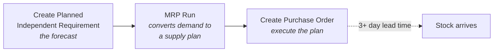

# ERPSim — Competitive Business Simulation

A live, timed simulation in which teams run a manufacturing company inside a real
SAP system, competing simultaneously against other teams in a shared market.
Pricing, production, procurement, and marketing decisions all take effect in real
time and are scored on financial outcomes.

## Result

| | |
|---|---|
| **Final rank** | **1st** |
| Company valuation | €1.56M |
| Cumulative net income | €39,037.01 |
| Format | Face-to-face, 3 rounds, 4-person team |

## What I ran

Across three rounds I covered inventory monitoring, price maintenance,
replenishment, and forecasting.

**Replenishment** was the most demanding, because it is a three-step chain that
has to be executed in order and with lead time in mind:

**Pricing** was managed through the price list app against live demand, and
**demand generation** through daily marketing budgets.

## What I learned that reading could not teach

**Lead time makes the plan, not the forecast.** Replenishment took three or more
simulated days to arrive. Reacting when stock ran low was already too late — the
order landed after the stockout. Getting this right meant running MRP and
raising purchase orders against *projected* demand, several periods ahead of the
shortage. Reactive replenishment cannot work in a system with non-zero lead time,
regardless of how good the forecast is.

**Price and demand are a feedback loop, not a setting.** Lowering price when
sales slowed and raising it when demand strengthened only worked when paired with
the inventory position. Cutting price into a low stock position generates demand
you cannot fill — which costs more than the margin gained.

**Marketing spend has a stock precondition.** We increased marketing to lift
demand and cut it when inventory was thin or targets were already being met.
Spending to create demand you cannot serve converts budget directly into
stockouts.

**Concurrency is a real operational constraint.** The system allows only one user
in certain apps at a time. Coordinating who was in which transaction was a
genuine constraint on team throughput — an unusually direct lesson in why
enterprise systems need record locking, and why that locking shapes how teams
have to organise around them.

## Why this transfers

The simulation compresses into a few hours the feedback loop that a real supply
chain runs over months: decision, delay, consequence. The specific lesson —
that lead time turns planning from a forecasting problem into a timing problem —
is the same one documented in the
[plan-to-produce process notes](../03-process-documentation/plan-to-produce.md),
except here it was learned by losing sales to it first.
