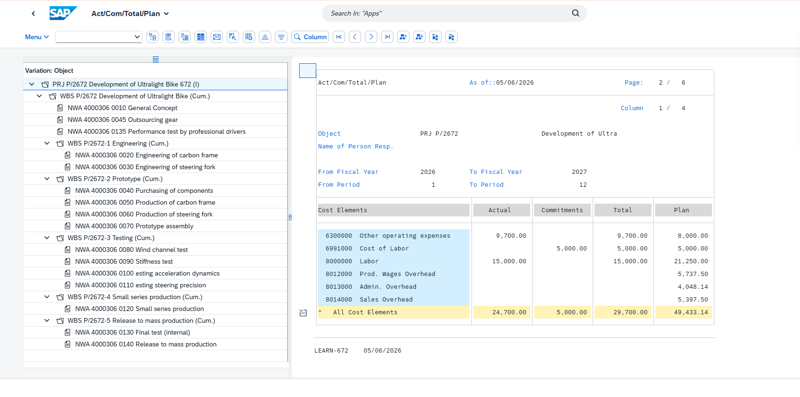

# Intelligent Enterprise Systems

Analytical work built on hands-on execution of core business process cycles in
**SAP S/4HANA 2022**, plus the data analysis and process documentation that came
out of it.

MS Management Information Systems, Lamar University.

> **For students:** this repository contains analysis, process documentation and
> findings — not answers. Completed case-study submissions are deliberately
> excluded, along with the copyrighted SAP UCC curriculum. What is here is
> intended to explain how the cycles fit together and how to interrogate the
> data they produce, which is the part that stays useful after the module ends.

---

## Start here

**[Order-to-Cash Analytics →](01-order-to-cash-analytics/findings.md)**
708 SAP sales orders analysed in SQL. The order book appears to have no customer
concentration risk — until you group on a different field and find one customer
spread across 88 business partner records worth 13.2% of revenue.

---

## Projects

### [1. Order-to-Cash Analytics](01-order-to-cash-analytics/) — SQL, Python, SQLite

708 sales orders (€8.88M) extracted from SAP S/4HANA and analysed end to end:
data preparation, six SQL queries, and a findings write-up.

- **Duplicate customer masters invert the concentration finding.** By business
  partner ID, no account exceeds 1.4% of revenue. By customer name, one account
  is 13.2%. Same data, opposite conclusions.
- **€1.1M (12.4%) of the order book is unfulfilled**, and stalled orders run 29%
  smaller than completed ones.
- **Seven orders have delivery dates before their order dates** — four marked
  Completed, enough to invalidate any on-time-delivery metric built on the table.

SQL uses CTEs and window functions. Runs on the standard library alone.

### [2. Web Session Analysis](02-web-session-analysis/) — Python, regression

50 customer web sessions. Which on-site behaviour actually predicts spend?

- **Pages viewed predicts spend; time on site mostly does not.** Adding time to a
  pages-only regression lifts R² by 3.4 points. Each additional page viewed is
  worth **$9.30** in spend.
- That flips the obvious recommendation: the lever is catalogue exposure, not
  dwell time.
- **The two source workbooks disagree.** Documented the conflict, traced it to a
  paste error, showed the bounded impact, and stated which copy was used.

### [3. SAP Process Documentation](03-process-documentation/) — process mapping

Mermaid process maps for Order-to-Cash, Procure-to-Pay, Plan-to-Produce,
Record-to-Report, and Project Accounting — with the integration points between
them. Written from execution notes, focused on where the cycles connect and
where that goes wrong: GR/IR clearing, three-way matching, commitment vs actual
cost, and allocation bases that silently change product cost.

### [4. ERP Procurement Research](04-erp-procurement-research/) — analysis, communication

How procurement operates at $400B scale (Walmart / Oracle ERP Cloud). Delivered
as a 10-minute presentation. Includes the [17-question Q&A reference](04-erp-procurement-research/qa-reference.md)
prepared to defend it, and an explicit note on which vendor-published figures I
would not present to a decision-maker without caveats.

### [5. ERPSim Business Simulation](05-erpsim-simulation/) — **1st place**

Live competitive simulation inside a real SAP system. **Finished 1st** with
**€1.56M company valuation** and **€39,037 cumulative net income**, running
forecasting, MRP, pricing, and replenishment against other teams in real time.

---

## The system behind the analysis



*Project cost report in SAP S/4HANA. The **Commitment** column — €5,000 ordered
but not yet invoiced — is the one most often dropped from budget reporting, and
the reason a project showing €24,700 actual against a €49,433 plan is carrying
€29,700 of real exposure.*

Five more screenshots, and a note on how they were redacted, in
[evidence/](evidence/).

---

## Skills demonstrated

| | |
|---|---|
| **SQL** | CTEs, window functions, running totals, aggregation, data quality checks |
| **Python** | Data preparation, OLS regression from first principles, SQLite |
| **SAP S/4HANA** | MM, PP, FI, CO and PS executed end to end; SD through inquiry and pricing. Fiori 3.0 |
| **Analysis** | Descriptive statistics, correlation, multiple regression, concentration analysis |
| **Data quality** | Duplicate master detection, referential checks, source reconciliation |
| **Process** | Cross-functional mapping, document flow, internal controls |
| **Communication** | Findings write-ups, executive presentation, defended Q&A |

---

## A note on the data

Both datasets are synthetic and safe to publish. **Global Bike** is SAP's
publicly documented teaching client; the web-session data is a textbook case
study. Neither contains real customer or company information.

The Global Bike client is shared across an entire course, so some patterns in it
are artefacts of that rather than commercial signals. The findings documents say
explicitly which are which — separating a real signal from a system artefact is
the point of the exercise, not an inconvenience to hide.

Course submissions, copyrighted curriculum material, and peer evaluations of
classmates are deliberately excluded from this repository. See
[evidence/README.md](evidence/README.md).

## Licence

Code and documentation are MIT licensed — see [LICENSE](LICENSE). The datasets
are synthetic teaching data as described above and contain no real customer or
company information.

---

## Running the code

```bash
# Order-to-cash analysis — reproduces every number in findings.md
cd 01-order-to-cash-analytics
python scripts/run_analysis.py

# Web session analysis
cd 02-web-session-analysis
python analysis.py
```

Python 3.9+. No dependencies — SQLite is loaded in memory and the regression is
solved from first principles.

Both cleaned datasets are committed, so the analyses run immediately after
cloning. `01-order-to-cash-analytics/scripts/prepare_data.py` is included to show
the extraction and cleaning logic, but the raw SAP export it consumes is not
redistributed here.
